# Movement Analytics

[](https://github.com/dl1683/Movement-Analytics/actions/workflows/ci.yml)

**Computational movement quality analysis for physical AI**

A pipeline for generating synthetic human gait, extracting kinematic signals from video, computing movement quality metrics grounded in biomechanics literature, and visualizing results in real time. Built to establish the scientific and engineering foundation for a Movement Quality Score — a multidimensional scoring model for evaluating human and robotic movement from video.

<p align="center">
  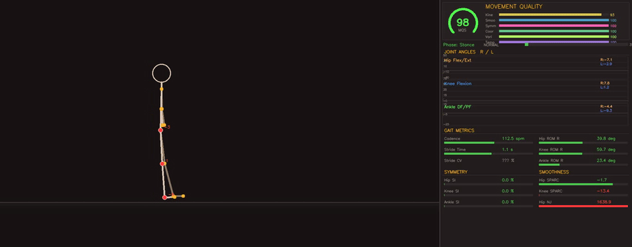
  <br>
  <em>Real-time dashboard: stick-figure animation with bilateral joint angle plots, MQS gauge, and 6-domain breakdown</em>
</p>

---

## Why This Exists

Physical AI has a measurement problem. Every humanoid robotics company ships policies optimized against internal benchmarks with no common scoring standard. The text-AI world solved this with evaluation companies (Arize, Braintrust, Weights & Biases). Physical AI has no equivalent.

This repository builds the technical proof that movement quality can be:
1. **Defined** — grounded in 90+ peer-reviewed biomechanics and motor-control citations
2. **Measured** — extracted computationally from video via MediaPipe pose estimation
3. **Scored** — quantified across 6 biomechanical domains using literature-derived reference ranges

---

## What's Here

### Research Foundation (`research/`)

A comprehensive literature review covering:

| Domain | Key Metrics | Key Citations |
|---|---|---|
| **Gait Cycle** | Spatiotemporal parameters, phase timing, speed | Perry & Burnfield 2010, Winter 2009 |
| **Joint Kinematics** | Hip/knee/ankle ROM, pelvis motion, deviations | Schwartz & Rozumalski 2008 |
| **Quality Indices** | Gait Deviation Index (GDI), Gait Profile Score (GPS) | Baker et al. 2009 |
| **Smoothness** | SPARC, Log Dimensionless Jerk, Normalized Jerk | Balasubramanian et al. 2012 |
| **Symmetry** | SI, Symmetry Ratio, Normalized Symmetry Index | Robinson 1987, Shorter 2020 |
| **Stability** | Margin of Stability, Lyapunov Exponents | Hof et al. 2005 |
| **Variability** | Stride CV, entropy, DFA | Hausdorff et al. 2001 |
| **Expert vs. Novice** | Motor variability, coordination, trained movers | Marineau 2024, Tanabe 2023 |

### Analysis Pipeline (`src/movement_analytics/`)

```
generators/     Procedural biomechanical gait synthesis (9 profiles)
kinematics/     Joint angle computation + gait quality metrics
visualization/  Real-time dashboard with time-series plots and gauges
pose/           Pose estimation integration (MediaPipe)
```

### 9 Gait Profiles

| Profile | Description | Key Feature |
|---|---|---|
| `normal` | Healthy adult at comfortable speed | Baseline reference |
| `slow` | Cautious elderly/post-injury | Reduced ROM, shorter stride |
| `fast` | Fast walk approaching jog | Increased ROM and cadence |
| `limp` | Asymmetric gait | 35% left-right asymmetry |
| `stiff_knee` | Reduced knee flexion in swing | Spastic gait pattern |
| `trendelenburg` | Excessive pelvic drop + trunk lean | Hip abductor weakness |
| `model_runway` | Trained fashion model walk | Exaggerated pelvis, controlled trunk |
| `noisy` | High motor variability | 4° noise on all joints |
| `parkinsonian` | Shuffling gait (Parkinson's) | Reduced ROM, diminished arm swing, short stride |

<details>
<summary><strong>Pathological gait examples (click to expand)</strong></summary>

<p align="center">
  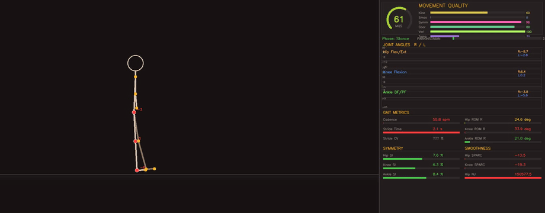
  <br>
  <em>Parkinsonian gait (MQS 61): shuffling rhythm, reduced ROM, severely degraded smoothness (SPARC floor = 0)</em>
</p>

<p align="center">
  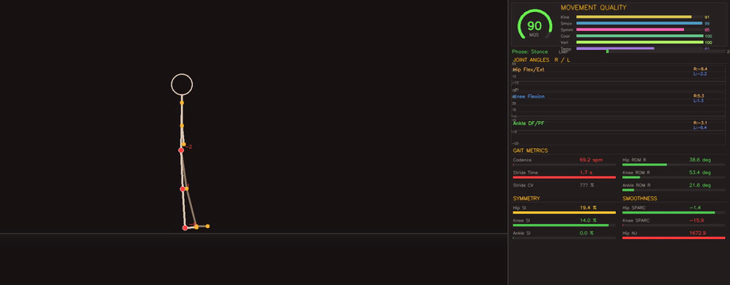
  <br>
  <em>Asymmetric limp (MQS 89): 35% left-right asymmetry detected via bilateral SI and frontal-plane pelvic drop</em>
</p>

</details>

### Movement Quality Score (MQS)

A composite **0–100 score** computed from 6 weighted biomechanical domains:

| Domain | Weight | Signals Used |
|---|---|---|
| **Kinematics** | 25% | Hip/knee/ankle ROM (bilateral) vs. clinical norms |
| **Smoothness** | 18% | SPARC of hip and knee velocity (spectral arc length) |
| **Symmetry** | 18% | Hip/knee/ankle/pelvis SI + hip waveform symmetry |
| **Coordination** | 14% | CRP consistency: inter-limb (bilateral hip) + intra-limb (hip-knee) |
| **Variability** | 13% | Stride time CV + stride-to-stride kinematic ROM CV |
| **Temporal** | 12% | Cadence and stride time vs. normal ranges |

MQS differentiates across profiles: normal gait scores highest across all domains, stiff-knee gait is penalized in kinematics (reduced knee ROM), noisy gait is penalized in smoothness and variability. Reference ranges sourced from Perry & Burnfield 2010, Winter 2009, Balasubramanian et al. 2012, Hausdorff et al. 2001, and Hamill et al. 1999.

<p align="center">
  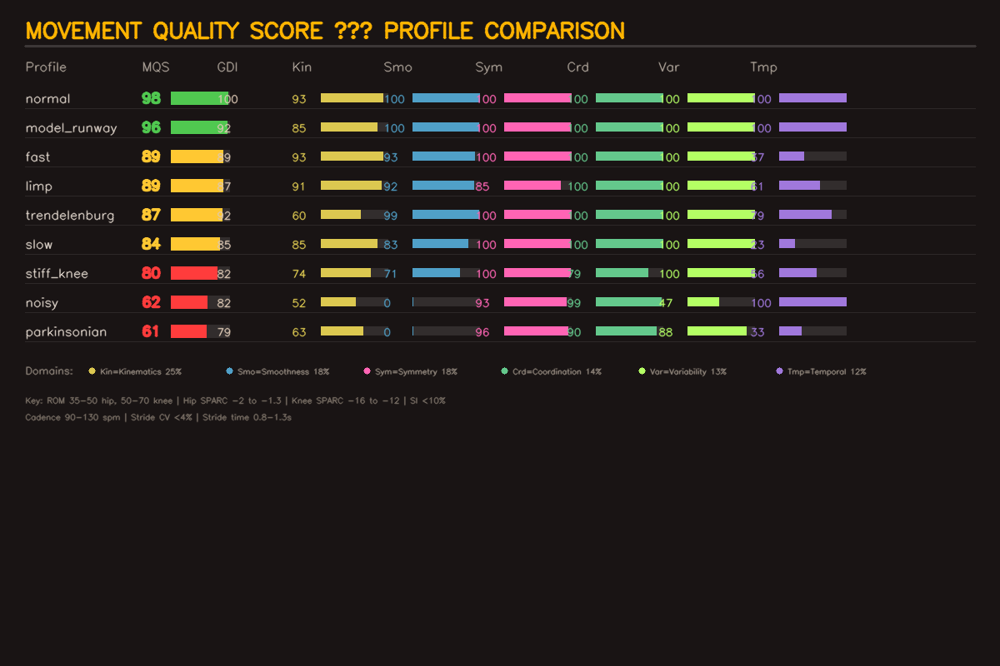
  <br>
  <em>MQS breakdown across 9 gait profiles — each domain reveals why a profile scores as it does</em>
</p>

**Synthetic vs. Video MQS:** Scores from the synthetic benchmark (above) use clean, noise-free angle trajectories and represent the scoring model's theoretical response. Video-derived MQS is scaled by a confidence factor (observed_fraction × mean_pose_confidence) to account for detection gaps and interpolation. When signal completeness drops below 50%, MQS returns NaN (insufficient evidence) instead of a misleading score. Video scores should be interpreted alongside `pose_observed_fraction`, `pose_interpolation_fraction`, and `mqs_confidence_factor` reported in the summary.

### Computed Metrics

For each gait profile, the pipeline computes **100+ metrics** in real time:

- **Movement Quality Score** — composite 0–100 with 6-domain breakdown
- **Joint ROM** — hip, knee, ankle (bilateral)
- **Peak angular velocity** — per joint
- **SPARC smoothness** — spectral arc length per joint velocity
- **Normalized Jerk** — per joint
- **Symmetry Index** — hip, knee, ankle, pelvis obliquity (left vs. right)
- **Waveform Symmetry** — shape-based bilateral comparison (NCC), sagittal + frontal
- **Symmetry Ratio** — bilateral comparison (sagittal + frontal)
- **Frontal Plane Asymmetry** — pelvis obliquity and trunk lean bilateral SI for pathology detection
- **Stride-Phase Pelvic Asymmetry** — half-cycle pelvic drop comparison (works from single video signal)
- **Signal Completeness** — per-domain fraction of present signals
- **Confidence Factor** — pose quality degradation for video-derived MQS
- **CRP Coordination** — inter-limb (bilateral hip) and intra-limb (hip-knee) phase coupling
- **Sufficient Evidence** — MQS returns NaN when signal completeness < 50% (prevents misleading scores from sparse data)
- **Stride-level ROM CV** — per-stride kinematic variability, composite mean scored in variability domain
- **Cadence** — steps per minute
- **Stride time** — mean and coefficient of variation
- **Double support time** — percentage of gait cycle with both feet on ground (diagnostic, from stance/swing ratio)
- **Gait Deviation Index (simplified)** — sagittal-plane waveform deviation from normal reference (inspired by Schwartz & Rozumalski 2008; uses synthetic reference, not clinical PCA)
- **DFA Scaling Exponent** — detrended fluctuation analysis of stride-to-stride intervals (Hausdorff 2001; diagnostic, requires ≥16 strides)
- **Heel contact detection** — video-based foot contact from heel landmark Y-position (refines gait event timing)
- **Arm swing metrics** — shoulder/elbow ROM (bilateral), arm swing SI, arm swing ratio vs. normal reference (detects Parkinsonian diminished arm swing)
- **Gait phase** — stance/swing detection with prominence-based heel strikes, heel-contact-refined when available

---

## Quick Start

```bash
# Clone and install
git clone https://github.com/dl1683/Movement-Analytics.git
cd Movement-Analytics
python -m venv .venv
.venv/Scripts/activate   # Windows
pip install -e .

# Run with live dashboard
python -m movement_analytics --profile normal

# Render specific profile to video
python -m movement_analytics --profile limp --output output/limp.mp4

# Render all profiles (headless)
python -m movement_analytics --all-profiles --output output/gait --no-display

# Analyze real video (downloads MediaPipe model on first run)
python -m movement_analytics --video path/to/walking.mp4 --output output/analysis.mp4

# Multi-view analysis (sagittal + frontal cameras)
python -m movement_analytics --video side.mp4 front.mp4 --view-labels sagittal,frontal --output output/multi.json
```

### CLI Options

```
--profile, -p     Gait profile (normal, slow, fast, limp, stiff_knee,
                  trendelenburg, model_runway, noisy, parkinsonian)
--output, -o      Output video path (MP4) or image path (PNG for --compare)
--no-display      Skip live window (headless rendering)
--fps             Frames per second (default: 30)
--cycles, -c      Number of gait cycles (default: 6)
--all-profiles    Generate all profiles
--compare         Generate MQS comparison report across all profiles
--video, -v       Input video file(s) for pose estimation analysis
                  (multiple files enable multi-view compositing)
--view-labels     Comma-separated view labels (e.g. 'sagittal,frontal')
--benchmark       Output MQS benchmark JSON across all profiles
--sensitivity     Generate MQS sensitivity analysis plots (PNG)
```

### Sensitivity Analysis

```bash
# Generate sensitivity plots showing MQS response to parameter variation
python -m movement_analytics --sensitivity --output output/mqs_sensitivity.png
```

The sensitivity report sweeps four parameters (knee ROM, noise level, asymmetry, pelvic obliquity) across the 6-domain MQS model. All curves are monotonic — the score degrades continuously as movement quality worsens, with no discontinuities or inversions. The pelvic obliquity sweep demonstrates frontal-plane pathology detection: kinematics score drops sharply beyond the 7° clinical threshold.

<p align="center">
  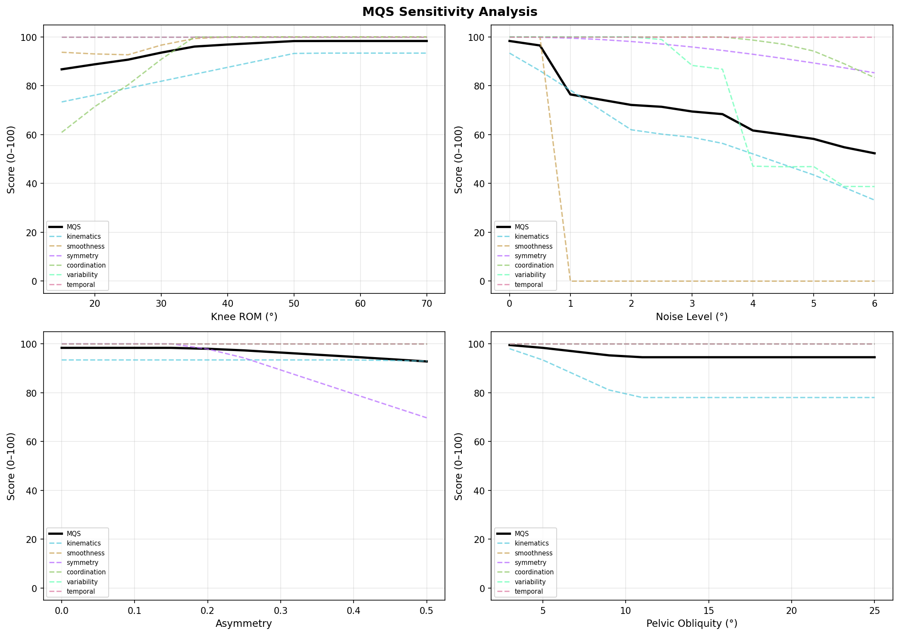
  <br>
  <em>MQS sensitivity: continuous, monotonic response to parameter degradation across all 6 domains</em>
</p>

### Profile Comparison

```bash
# Generate MQS comparison chart
python -m movement_analytics --compare --output output/mqs_comparison.png
```

The comparison report shows Movement Quality Score breakdowns across all 9 gait profiles, revealing how each domain contributes to the overall score.

### Reproducible Benchmark

```bash
# Output MQS benchmark as JSON (suitable for CI regression testing)
python -m movement_analytics --benchmark --output output/benchmark.json
```

The benchmark computes MQS and all domain/metric scores across all 9 profiles in a deterministic, reproducible format. Use `--cycles` to control the number of gait cycles evaluated.

### Python API

```python
from movement_analytics import (
    GaitParameters, GAIT_PROFILES, generate_frames,
    compute_gait_summary, mqs_domain_scores,
)

# Score a built-in gait profile
profile = GAIT_PROFILES["parkinsonian"]
_, angles_right, angles_left, _ = generate_frames(profile.params, n_cycles=6)
summary = compute_gait_summary(angles_right, angles_left, fps=30)

print(f"MQS: {summary['movement_quality_score']:.1f}")
print(f"GDI: {summary.get('GDI', 'N/A')}")
for domain, score in mqs_domain_scores(summary).items():
    print(f"  {domain}: {score:.1f}")

# Custom gait parameters
custom = GaitParameters(hip_rom=25, knee_rom=35, cadence=85)
_, ar, al, _ = generate_frames(custom, n_cycles=6)
custom_summary = compute_gait_summary(ar, al, fps=30)
print(f"Custom MQS: {custom_summary['movement_quality_score']:.1f}")

# Analyze real video (one-liner API)
from movement_analytics import analyze_video

result = analyze_video("path/to/walking.mp4")
print(f"Video MQS: {result['movement_quality_score_weighted']:.1f}")
print(f"Confidence: {result['mqs_confidence_factor']:.0%}")

# Multi-view analysis (sagittal + frontal cameras)
from movement_analytics import analyze_multi_view

result = analyze_multi_view(
    ["side_view.mp4", "front_view.mp4"],
    view_labels=["sagittal", "frontal"],
)
print(f"Multi-view MQS: {result['movement_quality_score_weighted']:.1f}")
```

---

## Architecture

```
Input: Gait Parameters OR Video File(s)
  ↓
┌─ Synthetic Path ─────────────────────────────────┐
│ Gait Model → Procedural joint angle trajectories │
└──────────────────────────────────────────────────┘
┌─ Video Path ─────────────────────────────────────────────────────────┐
│ MediaPipe Pose (VIDEO mode, multi-person)                            │
│   → Pelvis-based person tracking                                     │
│   → Physiological outlier rejection (pre-interpolation)              │
│   → Median pre-filter (impulsive noise removal)                      │
│   → PCHIP interpolation (cubic, linear fallback for sparse data)     │
│   → Physiological outlier rejection (post-interpolation)             │
│   → Confidence-adaptive two-pass Butterworth smoothing               │
│   → Multi-view merging (sagittal + frontal cameras)                  │
└──────────────────────────────────────────────────────────────────────┘
  ↓
Joint Angle Computation → Per-frame bilateral angle extraction
  ↓
Gait Metrics Engine → SPARC, NJ, SI, CRP, ROM, CV, cadence, phase detection
  ↓
Movement Quality Score → 6-domain composite (0–100) with confidence weighting
  ↓
Real-Time Dashboard → MQS gauge + bilateral plots + metric panels
  ↓
Output: Video file, JSON summary, and/or live display
```

### Video Pipeline: Signal Processing

The video analysis path applies a 6-stage signal processing pipeline to extract clinically meaningful kinematics from noisy 2D pose estimation:

1. **Pose estimation** — MediaPipe Pose (VIDEO mode) with `num_poses=3` for multi-person scenes. The closest subject is tracked across frames using pelvis centroid continuity.

2. **Physiological outlier rejection** — Per-joint angles outside clinically plausible ranges (e.g., knee flexion -20–160°, hip flexion -50–120°) are replaced with NaN before interpolation.

3. **Median pre-filter** — 5-sample median filter removes impulsive noise (single-frame spikes) from pose estimation jitter. Operates on non-NaN segments, preserving gaps.

4. **Gap filling** — PCHIP (Piecewise Cubic Hermite Interpolating Polynomial) interpolation for gaps with <50% missing data, preserving waveform shape without Runge oscillation. Sparse signals (>50% missing) fall back to linear interpolation.

5. **Adaptive smoothing** — Two-pass Butterworth filter: aggressive 3 Hz cutoff on low-confidence frames (MediaPipe confidence < 0.7), standard 6 Hz on high-confidence frames. Preserves genuine movement dynamics while suppressing pose estimation jitter.

6. **Confidence-weighted scoring** — MQS is scaled by `observed_fraction × mean_pose_confidence`. When signal completeness drops below 50%, MQS returns NaN (insufficient evidence) rather than a misleading score.

Per-joint detection rates are reported in metadata, enabling downstream quality assessment.

---

## Movement Quality Signal Framework

The research document identifies **20 signals** across 6 domains that form the basis for the Movement Quality Score:

| # | Signal | Domain | Clinical Reference |
|---|---|---|---|
| 1 | Hip flexion/extension ROM | Kinematics | 40–45° normal |
| 2 | Knee flexion ROM | Kinematics | 60–65° normal |
| 3 | Ankle dorsiflexion ROM | Kinematics | ~30° normal |
| 4 | Pelvic obliquity amplitude | Kinematics | <7° normal |
| 5 | Hip angular velocity (peak) | Dynamics | — |
| 6 | SPARC (hip velocity) | Smoothness | -1.5 to -1.7 (smooth) |
| 7 | SPARC (knee velocity) | Smoothness | -1.5 to -1.7 (smooth) |
| 8 | Hip flexion Symmetry Index | Symmetry | <10% normal |
| 9 | Knee flexion Symmetry Index | Symmetry | <10% normal |
| 10 | Pelvis obliquity Symmetry Index | Symmetry | <10% normal |
| 11 | Stride time CV | Variability | 1–3% normal |
| 12 | Cadence | Temporal | 100–120 spm |
| 13 | Double support time | Temporal | ~20% of cycle |
| 14 | Trunk lateral lean | Kinematics | <5° normal |
| 15 | Inter-limb coordination (CRP) | Coordination | — |
| 16 | Gait Deviation Index (simplified) | Composite | 100 = normal |
| 17 | DFA Scaling Exponent (α) | Variability | ~0.75 healthy (fractal) |
| 18 | Arm swing ROM | Upper body | ~25° normal shoulder flexion |
| 19 | Arm swing ratio | Upper body | 1.0 = normal, <0.7 = diminished (Parkinsonian) |
| 20 | Kinematic CV (composite) | Variability | 0–5% normal, scored in MQS variability domain |

---

## Dependencies

- Python ≥ 3.10
- NumPy, SciPy, OpenCV, MediaPipe, Matplotlib

---

## Variance Study: Runway Walks vs. Internet Walking Video

**Do professional runway walks have lower kinematic variance than general internet walking data?** We tested this quantitatively by processing 22 runway videos and 17 YouTube-sourced control walking videos through the full Movement Analytics pipeline, then applying rigorous multivariate statistical analysis across 24 biomechanical metrics.

**[Full paper with complete mathematical derivations →](docs/papers/variance_study.md)**

### Key Finding: 2.56× Lower Variance in Runway Walks

<p align="center">
  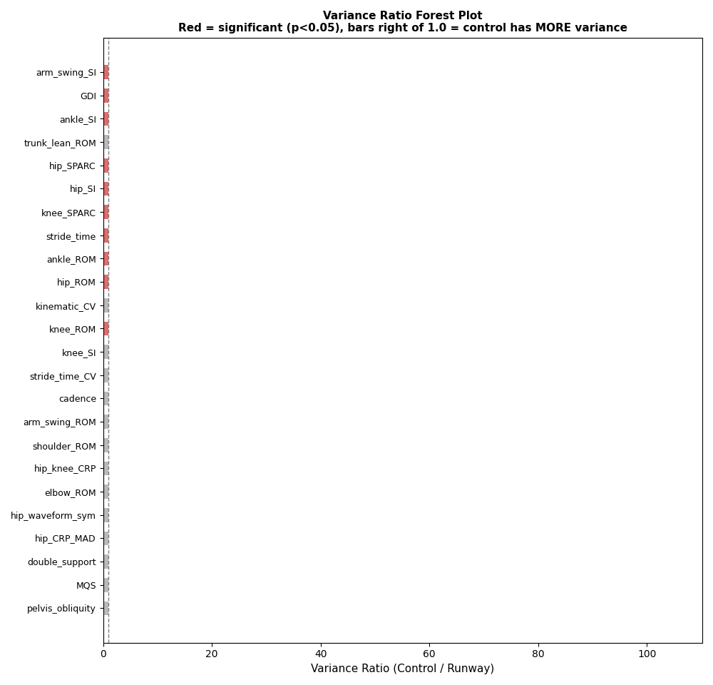
  <br>
  <em>Variance ratio forest plot: bars right of 1.0 = control has MORE variance. Red = statistically significant (p&lt;0.05).</em>
</p>

Control walking data exhibits **2.56× higher median kinematic variance** than runway walks. Of the 10 metrics reaching statistical significance (Levene's test, $p < 0.05$), **all 10 show higher variance in control** — zero in the reverse direction. Six survive Bonferroni correction ($\alpha = 0.0021$).

### Strongest Effects by Domain

<p align="center">
  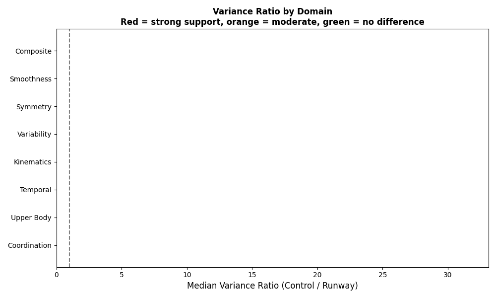
  <br>
  <em>Variance ratio by movement quality domain. Red = strong support for lower runway variance.</em>
</p>

| Domain | Median Variance Ratio | Significant / Total |
|--------|----------------------|-------------------|
| **Smoothness** | **17.0×** | 2/2 |
| **Symmetry** | **13.9×** | 3/5 |
| Composite (GDI) | 28.8× | 1/2 |
| Kinematics | 2.7× | 3/7 |
| Temporal | 1.7× | 1/3 |
| Coordination | 1.3× | 0/2 |

The variance reduction is strongest in **smoothness** (how fluid the movement is) and **symmetry** (left-right consistency) — exactly the qualities that matter for robot movement learning.

### Multivariate Separation: PCA

<p align="center">
  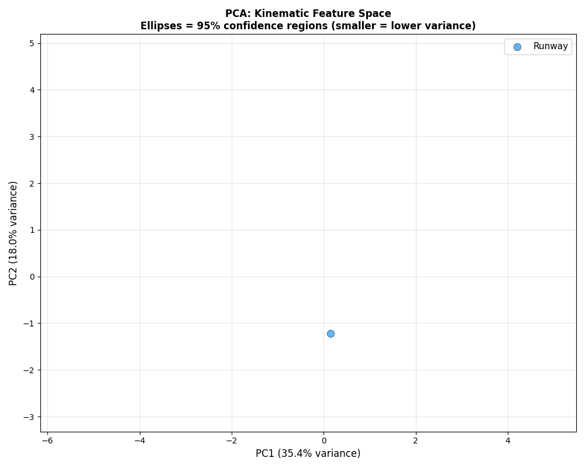
  <br>
  <em>PCA projection: runway walks (blue) cluster tightly; control videos (orange) scatter widely. Ellipses = 95% confidence regions.</em>
</p>

In the multivariate kinematic feature space:
- Runway spread is **2.13× smaller by trace** and **25× smaller by volume**
- 3 principal components explain 65.7% of total variance
- PC1 loads on ROM and smoothness; PC2 loads on temporal and symmetry

### Bootstrap Confidence

<p align="center">
  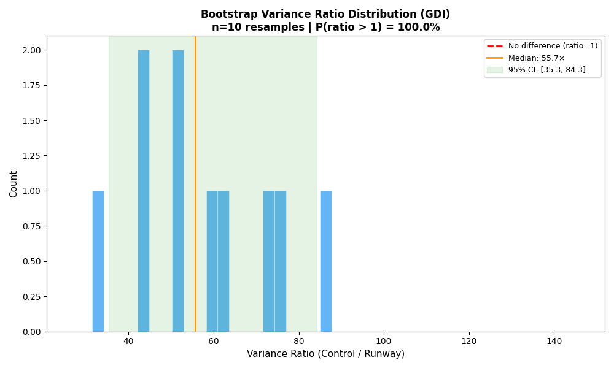
  <br>
  <em>Bootstrap resampling (10,000 iterations) for GDI variance ratio. P(control variance > runway) = 100%.</em>
</p>

### Effect Sizes

<p align="center">
  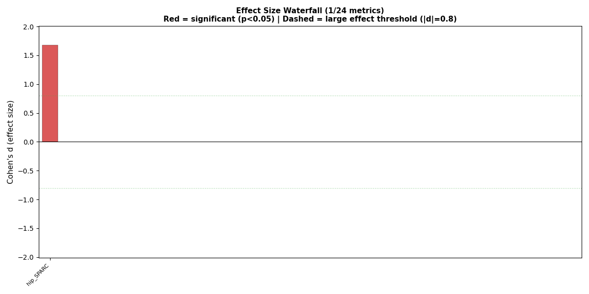
  <br>
  <em>Cohen's d effect sizes across all 24 metrics. Red = significant (p&lt;0.05). Dashed lines = large effect threshold (|d| = 0.8).</em>
</p>

### Mathematical Framework

The analysis pipeline extracts joint angles from pose estimation landmarks using the vector dot product:

$$\theta = \arccos\left(\frac{(\mathbf{A} - \mathbf{B}) \cdot (\mathbf{C} - \mathbf{B})}{\|\mathbf{A} - \mathbf{B}\| \cdot \|\mathbf{C} - \mathbf{B}\|}\right)$$

**Movement smoothness** is quantified via Spectral Arc Length (SPARC), the arc length of the normalized velocity spectrum:

$$\text{SPARC} = -\sum_{k=1}^{K-1} \sqrt{(f_{k+1} - f_k)^2 + (\hat{V}_{\text{norm}}(f_{k+1}) - \hat{V}_{\text{norm}}(f_k))^2}$$

**Bilateral symmetry** uses the Robinson Symmetry Index:

$$\text{SI} = \frac{2|X_R - X_L|}{X_R + X_L} \times 100\%$$

**Inter-limb coordination** via Continuous Relative Phase (Hilbert transform):

$$\text{CRP}(t) = \arg\left(\mathcal{H}\{\theta_a(t)\}\right) - \arg\left(\mathcal{H}\{\theta_b(t)\}\right)$$

**Movement Quality Score** — composite 0–100 weighted sum across 6 domains:

$$\text{MQS} = \sum_{d \in \mathcal{D}} w_d \cdot S_d, \quad w = \{0.25, 0.18, 0.18, 0.14, 0.13, 0.12\}$$

**Variance equality** tested via Levene's statistic:

$$W = \frac{(N-k)}{(k-1)} \cdot \frac{\sum_i n_i(\bar{Z}_{i\cdot} - \bar{Z}_{\cdot\cdot})^2}{\sum_i \sum_j (Z_{ij} - \bar{Z}_{i\cdot})^2}, \quad Z_{ij} = |X_{ij} - \bar{X}_{i\cdot}|$$

Full derivations of all 24 metrics, the 6-stage signal processing pipeline, and all statistical tests are in the [paper](docs/papers/variance_study.md).

### Static Figures

<details>
<summary><strong>Variance forest plot with bootstrap CIs (click to expand)</strong></summary>
<p align="center">
  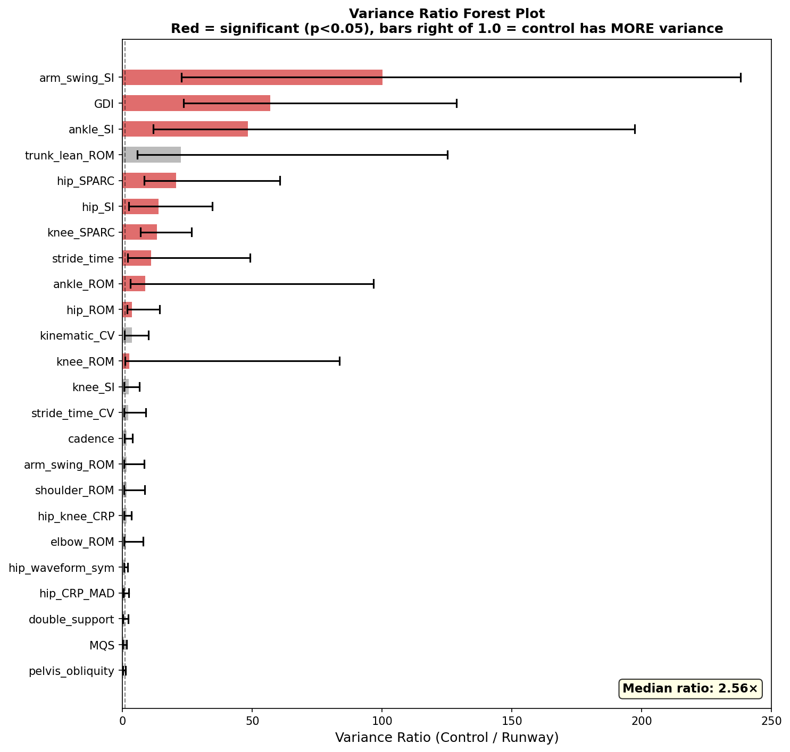
</p>
</details>

<details>
<summary><strong>PCA scatter with 95% confidence ellipses</strong></summary>
<p align="center">
  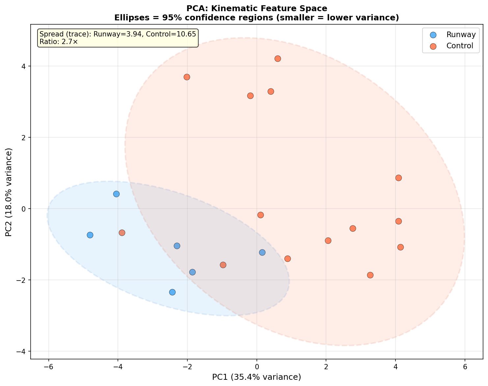
</p>
</details>

<details>
<summary><strong>Coefficient of variation comparison</strong></summary>
<p align="center">
  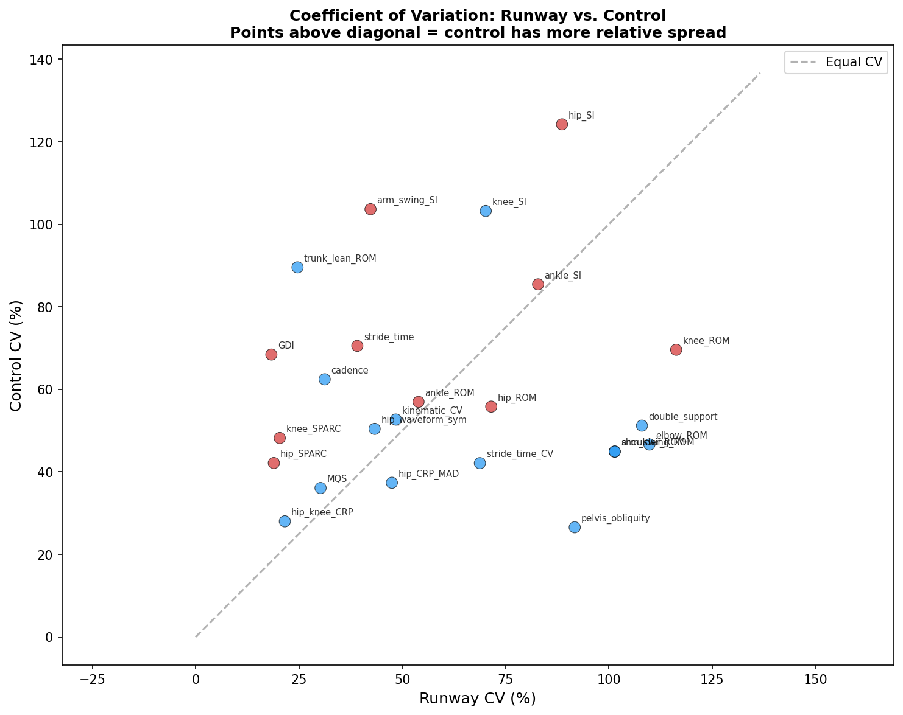
</p>
</details>

<details>
<summary><strong>Domain-level variance summary</strong></summary>
<p align="center">
  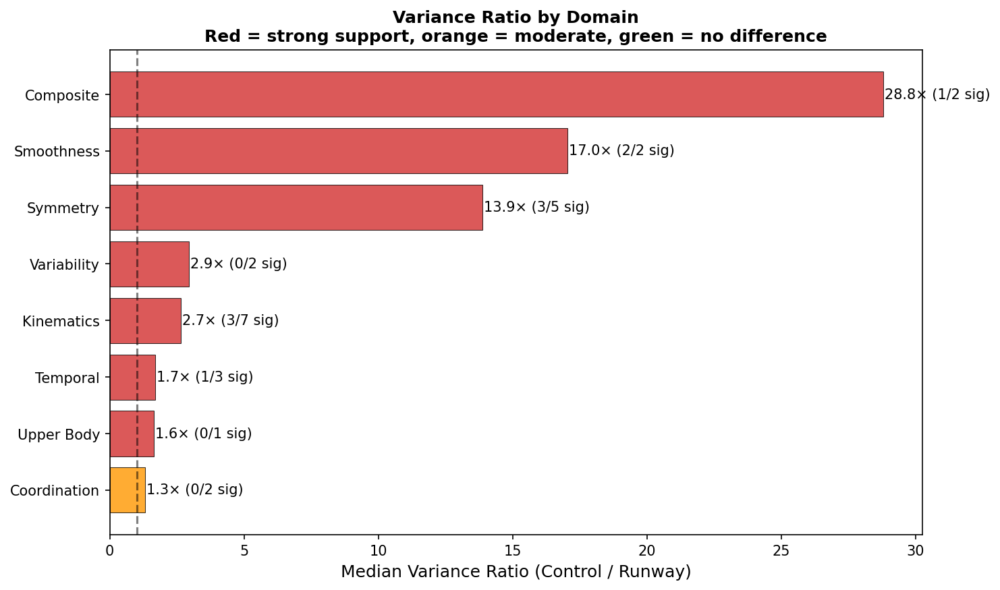
</p>
</details>

### Reproduce

```bash
# Process videos through MediaPipe pipeline
python scripts/variance_study.py --process

# Run statistical analysis + generate figures
python scripts/variance_study.py --analyze

# Generate animated GIFs
python scripts/generate_gifs.py
```

Results: `data/results/` (report, CSVs, JSONs). Figures: `data/figures/` (7 PNGs). GIFs: `docs/assets/` (5 animations).

---

## Project Status

| Component | Status |
|---|---|
| Research document | 90+ citations, 10 sections |
| Gait model (9 profiles) | Implemented, tested |
| Stick-figure renderer | Implemented |
| Joint angle computation | Implemented, 100% coverage |
| Gait metrics engine | Implemented, 98% coverage (synthetic path) |
| Movement Quality Score | 6-domain composite (MQS v1.8) with evidence gating, frontal-plane dedup, bilateral SPARC, intra-limb CRP, validated on 9 profiles (61.1–98.3 range) |
| Real-time dashboard | Implemented (bilateral overlays, MQS gauge, 6-domain breakdown, NaN-safe) |
| Video pose estimation | MediaPipe VIDEO mode with pelvis-based person tracking, PCHIP interpolation, adaptive confidence-weighted smoothing, physiological outlier rejection, heel contact detection, confidence-weighted MQS, per-joint detection rates, memory-efficient headless mode, 96% unit test coverage |
| Multi-view analysis | Sagittal + frontal camera merging into unified MQS, auto-detects best view per signal domain |
| Gait Deviation Index | Simplified GDI (Schwartz & Rozumalski 2008), 100 = normal, validated on 9 profiles (78.1–100.0 range) |
| CI/CD | GitHub Actions, 236 tests (incl. MQS regression baselines), ruff lint, 70% coverage gate (95% actual) |
| Reproducible benchmark | JSON output with locked regression baselines |
| Variance study | 22 runway vs. 17 control videos, 24 metrics, 4-layer statistical analysis, 7 figures, 5 animated GIFs, [full paper](docs/papers/variance_study.md) |
| Learned MQS weights | Planned (expert rater calibration) |

---

## License

Proprietary. All rights reserved.
